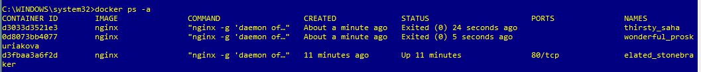
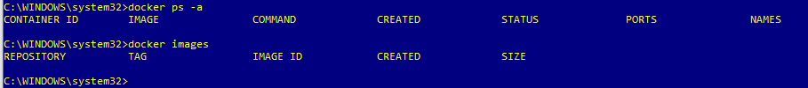

### DevOps With Docker
Eeva-Maria Laiho

# Part 1

# 1.1



# 1.2



# 1.3

To start the container:
```$ docker run -it devopsdockeruh/pull_exercise```

The script asks for password, that is ```basic```.

After typing the password the script prints:
```
You found the correct password. Secret message is:
"This is the secret message"
```

# 1.4

To start the container
```$ docker run -d --name bashex devopsdockeruh/exec_bash_exercise```

To go inside the container
```$ docker exec -it bashex bash```

To tail the log
```$ tail -f ./logs.txt```

Which will print:
```
"Docker is easy"
Sat, 21 Dec 2019 06:59:55 GMT
Sat, 21 Dec 2019 06:59:58 GMT
Sat, 21 Dec 2019 07:00:01 GMT
Sat, 21 Dec 2019 07:00:04 GMT
Secret message is:
"Docker is easy"
Sat, 21 Dec 2019 07:00:10 GMT
Sat, 21 Dec 2019 07:00:13 GMT
Sat, 21 Dec 2019 07:00:16 GMT
Sat, 21 Dec 2019 07:00:19 GMT
```
To exit tailing and the container ```Ctrl+C``` and ```Ctrl+P, Ctrl+Q```
